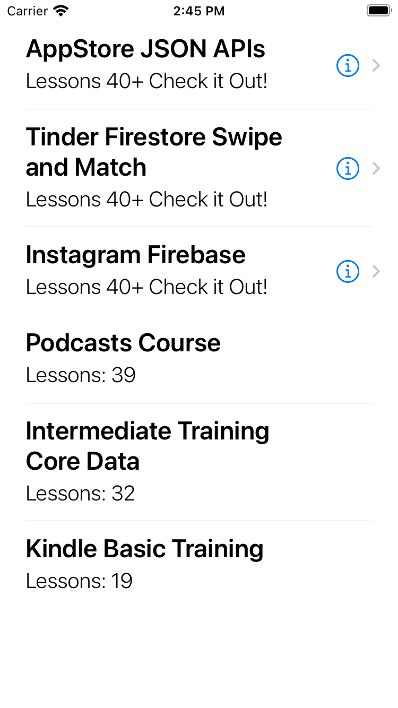

# RefactorToMVVMTalk
This is the final repo for a talk I gave on refactoring a simple MVC app to MVVM and implementing unit tests. The talk was aimed at anyone who was completely new to the MVVM pattern and unit tests. 

[View the talk on YouTube](https://youtu.be/X5E5oKdmJA0)

**Topics Covered**

- Avoiding massive view controllers by pulling out business logic from views

- How to create a ViewModel to pass into the view only what it needs, therefore making the views "unaware" of the model

- How to add unit tests to a project, how to write basic assertions, and how to test the CourseViewModel object

- Why MVVM and unit testing is ideal for large projects with many developers

**App Screenshot**

**Highlights**

- Calls an API to get data about courses

- Cells display a title, subtitle, and accessoryType

- The subtitle and accessoryType are determined by the numberOfLessons property on the Course model object

